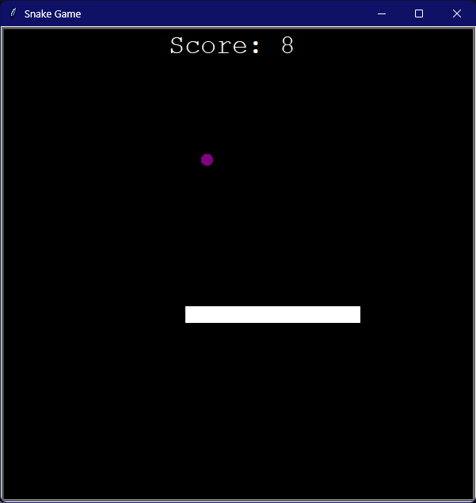
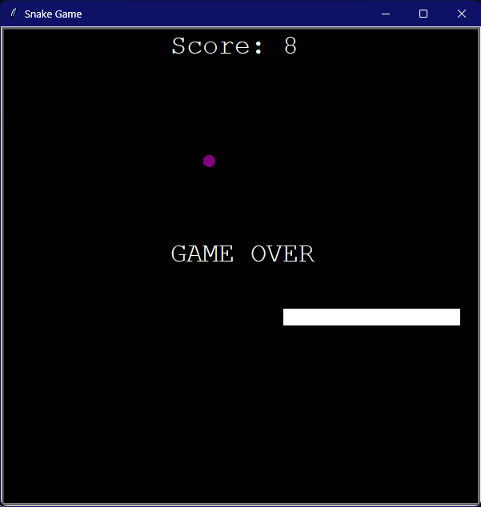

# Classic Snake game

Language: Python

This game uses turtle module for GUI. Game scores are stored in a data.txt file.

## Imports:
```python
    import turtle
    import time
    import random
```

## Custom Modules:
```
    food.py
    scoreboard.py
    snake.py
```

## Game Screenshots:

### During game screen
   
### Game over Screen
